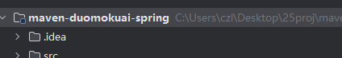
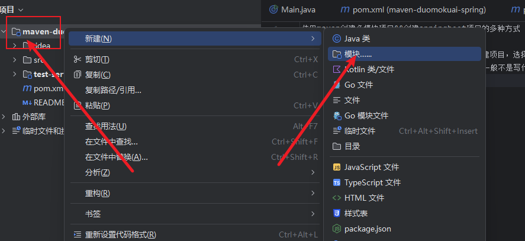
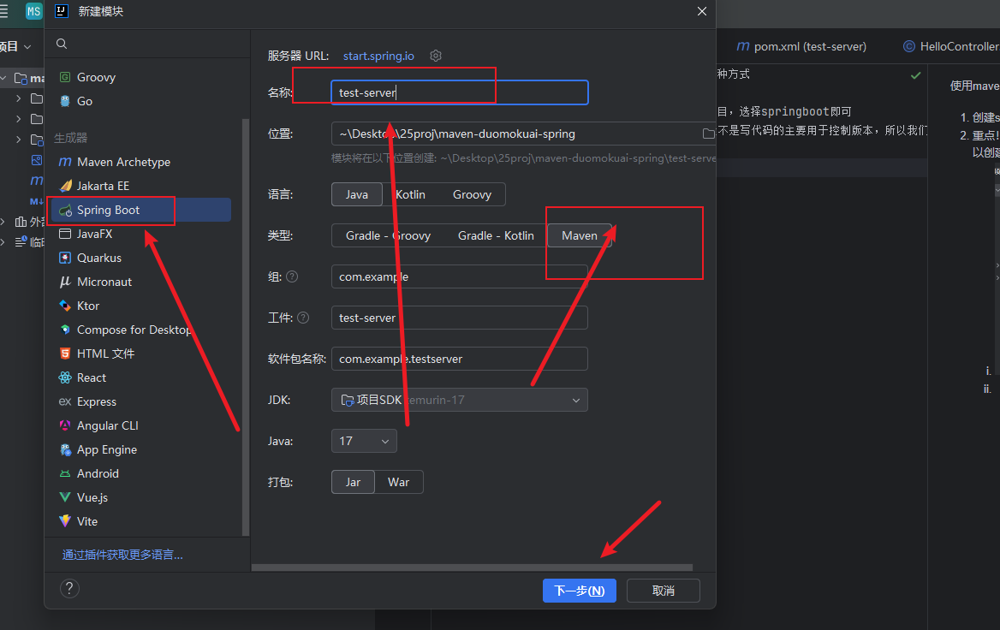
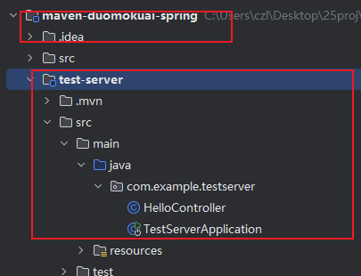

使用maven创建多模块项目&&创建springboot项目的多种方式

1. 创建springboot项目，直接用idea最简单的新建项目，选择springboot即可
2. 重点！！ 需要用到多模块的时候，maven父项目一般不是写代码的主要用于控制版本，所以我们可以创建空文件夹or maven项目（java入口）
   1. 
   2. 
   2. 
   3. 最后的效果，父亲层 包着 儿子层
   4. 